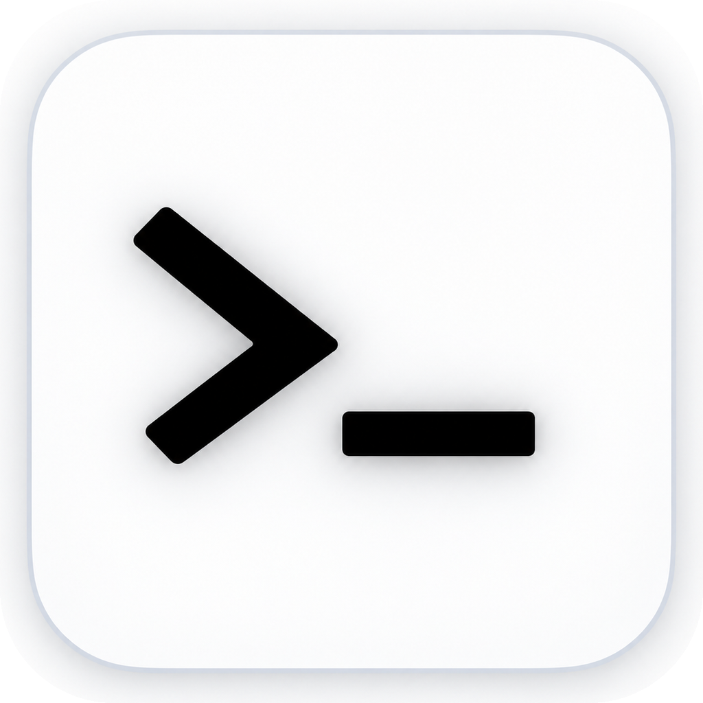
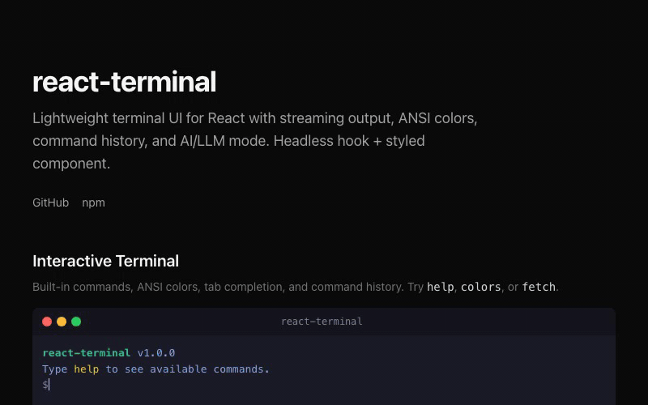

<p align="center"></p>

<h1 align="center">react-termview</h1>

<p align="center">
  Lightweight terminal UI for React with streaming output, ANSI colors, command history, and AI/LLM mode.<br/>
  Headless hook + styled component.
</p>

<p align="center">
  <a href="https://www.npmjs.com/package/react-termview"></a>
  
  
</p>

<p align="center">
  <a href="https://react-termview.mulkatz.dev"><strong>Live Demo</strong></a>
</p>

<p align="center">
  
</p>

## Why react-termview?

- **Headless + Styled**: Use `useTerminal()` hook for full control, or drop in `<Terminal>` for instant UI
- **ANSI Colors**: Built-in parser for 16/256/RGB colors, bold, italic, underline, strikethrough
- **Streaming-First**: Async command handlers with `write()` and `writeln()` for AI/LLM output
- **Tiny**: ~7KB minified, zero dependencies beyond React
- **Accessible**: ARIA live regions, keyboard navigation, screen reader support
- **Command History**: Arrow key navigation with deduplication
- **Tab Completion**: Auto-complete registered command names
- **Theming**: Dark and light themes, fully customizable via CSS

## Install

```bash
npm install react-termview
```

## Quick Start

```tsx
import { Terminal } from "react-termview";
import "react-termview/styles.css";

function App() {
  return (
    <Terminal
      commands={{
        hello: (args) => `Hello, ${args[0] || "world"}!`,
        clear: (_args, terminal) => terminal.clear(),
      }}
    />
  );
}
```

## Headless Mode

```tsx
import { useTerminal, Terminal } from "react-termview";
import "react-termview/styles.css";

function App() {
  const terminal = useTerminal({
    commands: {
      greet: (args) => `Hi ${args[0]}!`,
    },
    prompt: "> ",
  });

  return (
    <div>
      <button onClick={() => terminal.controls.writeln("System message")}>
        Inject Output
      </button>
      <Terminal terminal={terminal} />
    </div>
  );
}
```

## Streaming / AI Mode

```tsx
<Terminal
  commands={{
    ask: async (args, terminal) => {
      terminal.writeln("Thinking...");
      const response = await fetchAI(args.join(" "));
      for await (const chunk of response) {
        terminal.write(chunk);
      }
      terminal.writeln("");
    },
  }}
/>
```

## ANSI Colors

The built-in ANSI parser renders colored text without any extra dependencies:

```tsx
<Terminal
  commands={{
    status: () => "\x1b[32mOK\x1b[0m - All systems operational",
    error: () => "\x1b[1;31mERROR\x1b[0m - Something went wrong",
    rainbow: () => [
      "\x1b[31mR\x1b[33mA\x1b[32mI\x1b[36mN\x1b[34mB\x1b[35mO\x1b[91mW\x1b[0m",
    ].join(""),
  }}
/>
```

Supported: 16 colors, 256 colors (`\x1b[38;5;Nm`), RGB (`\x1b[38;2;R;G;Bm`), bold, dim, italic, underline, strikethrough.

## API

### `<Terminal>`

| Prop | Type | Default | Description |
|------|------|---------|-------------|
| `commands` | `Record<string, CommandHandler>` | `{}` | Command name to handler map |
| `onUnknownCommand` | `CommandHandler` | — | Called for unregistered commands |
| `initialLines` | `TerminalLine[]` | `[]` | Lines to display on mount |
| `prompt` | `string` | `"$ "` | Input prompt string |
| `maxLines` | `number` | `1000` | Max lines in scrollback |
| `maxHistory` | `number` | `100` | Max command history entries |
| `editable` | `boolean` | `true` | Whether input is enabled |
| `theme` | `"dark" \| "light"` | `"dark"` | Color theme |
| `title` | `string` | `"Terminal"` | Title bar text |
| `showTitleBar` | `boolean` | `true` | Show/hide title bar |
| `titleBar` | `ReactNode` | — | Custom title bar content |
| `terminal` | `UseTerminalReturn` | — | External hook instance |
| `className` | `string` | — | Additional CSS class |
| `style` | `CSSProperties` | — | Inline styles |
| `onLine` | `(line: TerminalLine) => void` | — | Called when a line is added |

### `useTerminal(options?)`

Returns `UseTerminalReturn` with:

| Property | Type | Description |
|----------|------|-------------|
| `lines` | `TerminalLine[]` | Current terminal output |
| `input` | `string` | Current input value |
| `controls` | `TerminalControls` | `write()`, `writeln()`, `clear()`, `focus()` |
| `setInput` | `(value: string) => void` | Set input programmatically |
| `handleKeyDown` | `KeyboardEventHandler` | Attach to input element |
| `suggestions` | `string[]` | Current tab completion suggestions |
| `isStreaming` | `boolean` | Whether a command is executing |
| `inputRef` | `RefObject<HTMLInputElement>` | Ref to the input element |

### `CommandHandler`

```ts
type CommandHandler = (
  args: string[],
  terminal: TerminalControls,
) => undefined | string | Promise<undefined | string>;
```

Return a string to output it. Use `terminal.write()` / `terminal.writeln()` for streaming.

### `parseAnsi(text)` / `stripAnsi(text)`

Standalone ANSI parsing utilities:

```ts
import { parseAnsi, stripAnsi } from "react-termview";

parseAnsi("\x1b[31mred\x1b[0m");
// => [{ text: "red", style: { color: "#e74c3c" } }]

stripAnsi("\x1b[31mred\x1b[0m");
// => "red"
```

## Keyboard Shortcuts

| Key | Action |
|-----|--------|
| `Enter` | Execute command |
| `ArrowUp/Down` | Navigate command history |
| `Tab` | Auto-complete command |
| `Ctrl+C` | Cancel current input |
| `Ctrl+L` | Clear terminal |
| `Escape` | Close suggestions |

## Theming

Import the default styles and override with CSS:

```css
.rt-terminal {
  font-size: 14px;
  border-radius: 12px;
}

.rt-terminal--dark {
  background: #0d1117;
  color: #c9d1d9;
}
```

All classes use the `rt-` prefix. See [styles.css](./src/styles.css) for the full list.

## License

MIT
